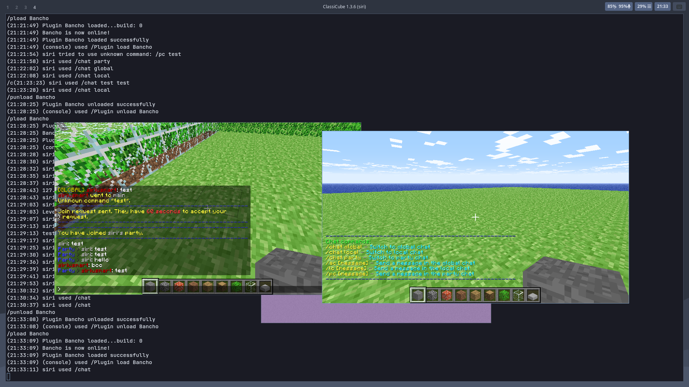
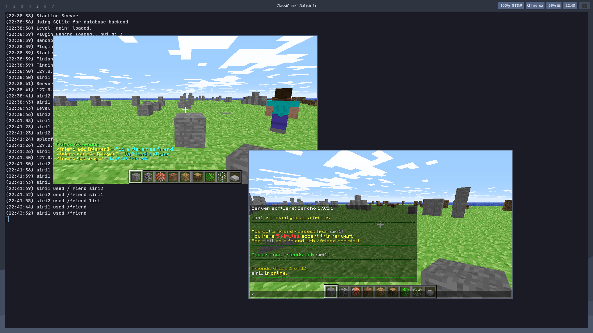

# Bancho Server

Socials plugin for ClassiCube/MCGalaxy.

## Party

Help command: `/party`

## Chat

Help command: `/chat`

## Friend

Help command: `/friend`

## Usage

> #### Custom server required
> This plugin requires a tweaked version of MCGalaxy, the Git repo can be found [here](https://github.com/Siriusmart/MCGalaxy). It adds extra functions for Bancho to use, and does not break existing plugins.

Download a [release](https://github.com/Siriusmart/ccBancho/releases) and copy all files to your server folder. Overwrite any old files if needed.

Load the plugin once to generate the .properties file.

### MongoDB

A MongoDB instance should be running without any authentication, add the line `mongodb-address = [address]` to properties/bancho.properties.

specs/\* contains the format of MongoDB documents.

> If you have a use case where you need to run MongoDB with authentication, open a pull request or let me know.

## Building

1. Git clone MCGalaxy such that the repo is available at ../
2. Edit `build-[target_os].sh` such that the first line points to your server folder, and run it.

> For developers: note that release.sh hides all errors during compile, so please check that the project is error-free before compiling.

## Roadmap

- [x] Party system
- [x] Chat channels
- [x] Broadcast scope
- [x] Friend system
- [ ] Guilds
- [ ] Player settings
- [ ] Games framework
